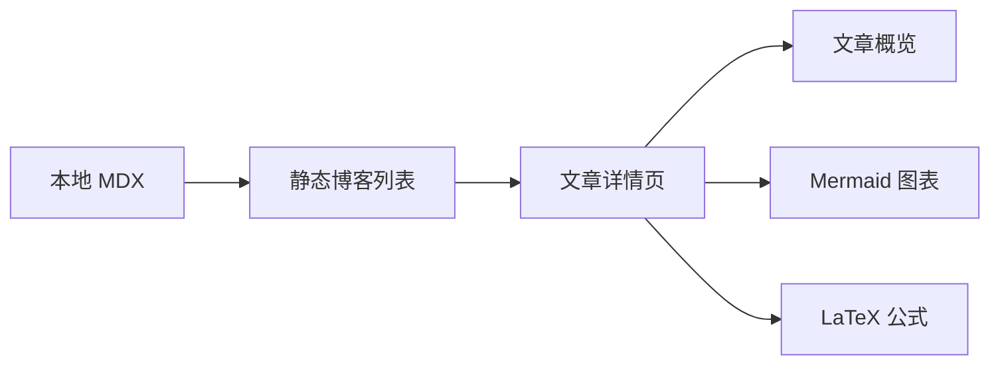

## 导言

最近 AI 工具大量涌现后，`vibe coding` 也从大量不确定性编码逐步往工程化的方向靠拢，编码和bug修复的自动化程度高了很多，所以能抽出时间把博客做了个初版。想做一个博客的想法 5 年前就有了，星空旅行、宇宙穿梭的想法早已萌芽，<a href="https://www.figma.com/design/9rdWuPlFfqRXZ1RaYF9LJW/DF-blog?node-id=1-2&t=tykB9KnFN9HcitNI-1" target="_blank">UI</a> 也在5年前的某个夜晚画了，当时还在光谷租房，才和老婆在一起。
兜兜转转，5年时间，在武汉买了房、成了家，有了一个健康成长的小宝贝，父母也来到武汉帮忙照顾孩子，虽然考研的事不太顺，房子也被割了韭菜，但一家人的生活总归是逐渐在变好。

## 关于 DogFooding

Dogfooding 是一个自我沉淀，验证输入和输出的自留地。AI 时代，除了烧掉的token和账单，我常常会思考，我到底留下了什么？或者做出了什么？做这些到底有用吗...而 dogfooding，用真实的体验脱虚向实，帮我们在魔幻的世界中找回生而为人的真实感。

## 关于 Dreaming Flower

Dreaming Flower 是这片个人空间的入口：以热忱为种，以坚持为壤，记录产品、体验和创作的生长过程。

> 写作会先保持轻量，等内容稳定后再考虑标签、搜索、RSS 等能力。

## 目前支持的一些 ShowCase

### Mermaid 示例

下面用 Mermaid 描述当前博客模块的轻量内容流：

### LaTeX 示例

行内公式可以写作 $E = mc^2$，块级公式可以用于表达更完整的关系：

$$
\sum_{i=1}^{n} i = \frac{n(n + 1)}{2}
$$

## 下一步

后续可以把文章或主题按照星球生成，根据标签形成星系，星球入口连接到博客，让阅读体验自然成为这片星系的一部分。
