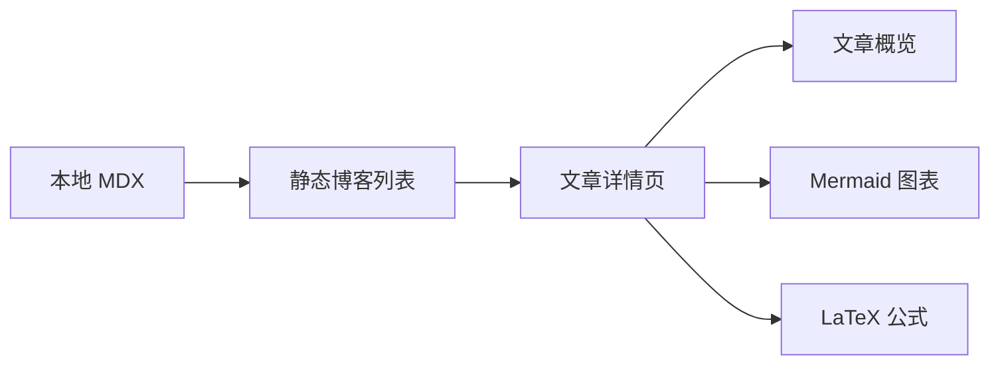

## 2从零开始的异世界生活

  DF 博客的概念，

## 关于 DogFooding

## 关于 Dreaming Flower

> 写作会先保持轻量，等内容稳定后再考虑标签、搜索、RSS 等能力。

## 示例：

### Mermaid 示例

下面用 Mermaid 描述当前博客模块的轻量内容流：

### LaTeX 示例

行内公式可以写作 $E = mc^2$，块级公式可以用于表达更完整的关系：

$$
\sum_{i=1}^{n} i = \frac{n(n + 1)}{2}
$$

## 下一步

后续可以把文章或主题按照星球生成，根据标签行程星系，星球入口连接到博客，让阅读体验自然成为这片星系的一部分。
