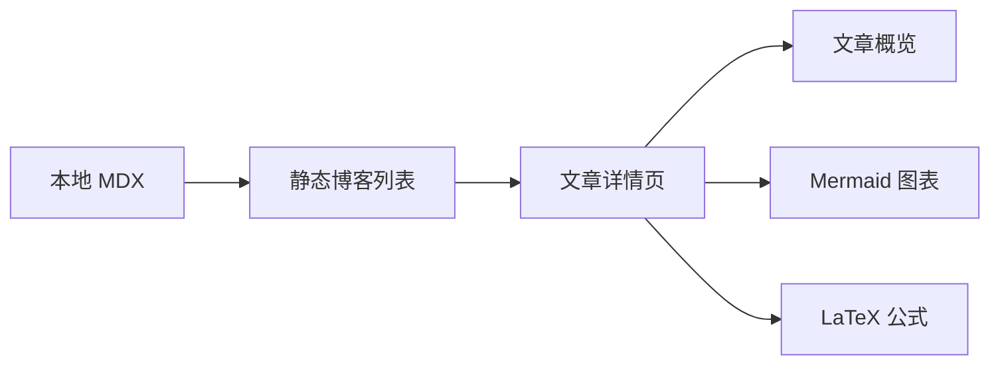

## 从星系入口开始

Dreaming Flower 是一个个人空间，也是一片正在生长的产品实验场。首页像一个星系入口，博客则用来沉淀过程中的想法、体验和复盘。

## 为什么先做 MDX

MDX 让文章保持在代码仓库里，既方便版本管理，也能在需要时嵌入 React 组件。当前阶段只需要静态内容，不引入 CMS、数据库或账号系统。

> 写作会先保持轻量，等内容稳定后再考虑标签、搜索、RSS 等能力。

## Mermaid 示例

下面用 Mermaid 描述当前博客模块的轻量内容流：

## LaTeX 示例

行内公式可以写作 $E = mc^2$，块级公式可以用于表达更完整的关系：

$$
\sum_{i=1}^{n} i = \frac{n(n + 1)}{2}
$$

## 下一步

后续可以把首页中的某个星球入口连接到博客，让阅读体验自然成为这片星系的一部分。
