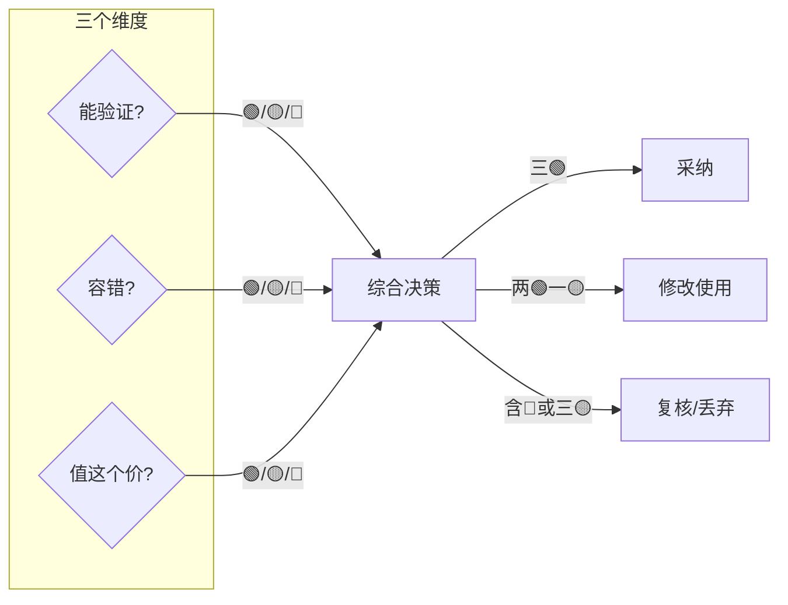

## 引言

下午三点，你正赶一个需求。习惯性的打开 AI，输入"帮我写个技术方案"，30 秒后一段文字出现，聊了几轮，改的差不多了又用 AI 转写成代码。反复了 <a href="https://github.com/github/spec-kit" target="_blank" rel="noopener">SDD（Spec-Driven Development）</a> 几轮后，你满意了。晚上回家路上，想起明天的汇报 PPT，打开 AI，又聊了几轮。睡前刷到一个有意思的问题，"为什么分布式系统不能用时钟同步"，丢给 AI，顺便把要点整理成一段话。

这一天，除去工作的重度使用，你大概问了 AI 七八个问题，每次都不长，每次都觉得"反正不贵"。

可打开用量统计一看：这个月才过了一半，订阅额度已经用掉了 89%。

这不是你一个人的故事。这是一个正在发生的、几乎没有人认真审视的问题：**我们在疯狂消耗 Token，但我们真的知道自己买到了什么吗？**

本文是一篇关于 AI 使用效率的冷思考。我们不讨论 AI 有多强大，不讨论它会取代谁的工作，我们只讨论一个朴素的问题：**当你烧完这些 Token，你到底收获了什么？**

---

## 一、Token 消耗的现状：一笔容易被忽视的账

### 1.1 重新看一下我们的消费账单

先看一组不那么精确，但足够说明问题的数字。

以 ChatGPT Plus（20 &dollar;/月）为例：如果你每天进行 10-15 次中等长度的对话，每次对话消耗约 2000-3000 个输入 Token + 1500 个输出 Token，那么一个月下来，你大概消耗了 **90 万到 150 万 Token**。这还没算 Plus 用户享有的更高上下文窗口带来的额外消耗。

如果你用的是 API——以截止 2026年5月30日第一梯队 OpenAI GPT-5.5 的定价为例：输入 5 &dollar;/百万 Token，输出 30 &dollar;/百万 Token（<a href="https://openai.com/api/pricing/" target="_blank" rel="noopener">OpenAI 官方定价页</a>，2026-05-14 更新）。一次中等复杂度的对话（输入 500 字约 600 Token + 输出 300 字约 400 Token），大约消耗 **0.006 + 0.012 = 0.018** &dollar;。一个中型项目项目的月账单轻松破百&dollar;，为此大多数人更多的会去选择相对便宜一些的个人 Plus 或 团队套餐席位拼车，定价基本在 20 &dollar;/月上下。

做个对比：一次 Google 搜索消耗的算力约为 **0.0003 &dollar;**。而一次中等复杂度的 AI 对话，保守估计是 **0.01-0.05 &dollar;**——是前者的 **30-150 倍**。

这不是在说 AI 贵。问题在于：**我们有没有意识到自己在花钱？以及，这笔钱花得值不值？**

### 1.2 "用 Token 买效率" 的心理模型

为什么我们愿意为 AI 付费，并且付得越来越痛快？

一个流行的心理模型是：**用 Token 买效率**。AI 省了 2 小时 = 值 2 小时 = 值得付费。

| ❌ 假设 | ✅ 现实 |
|--------|---------|
| AI 输出可直接使用 | 一半需修改，四分之一大幅修改，十分之一完全错误 |
| 省 2 小时 = 净赚 2 小时 | 省 2 小时 - 修改 1 小时 - 复查 0.5 小时 - 返工 0.5 小时 = **净收益 0** |

效率 ≠ 质量。速度 ≠ 正确。这是我们最容易忽略的隐性成本。

### 1.3 现象：为什么 Token 用量总是超预期？

| 1️⃣ 长对话累积 | 2️⃣ 再问一次 | 3️⃣ 缺乏精简 |
|---------------|-------------|-------------|
| 同一上下文窗口堆积 20 轮问答，每轮几百 Token，累加起来爆了 | 输出不满意就再问一次，成本双倍，还可能引入新问题 | 把所有信息丢给 AI，实际上 AI 只需核心，精简输入可减少 30%-50% 消耗 |

---

## 二、Token 消耗背后的问题

| 🎭 幻觉成本 | 🧩 上下文遗忘 |
|-------------|---------------|
| **看似正确，实则错误** | **长对话的隐形陷阱** |
| AI 以自信满满姿态生成虚假内容：代码 bug、引用造假、流畅≠正确 | AI 是"续写"不是"记忆"，上下文溢出时不会提醒，继续编下去 |

| 🧠 过度依赖 | 🎯 质量错觉 |
|-------------|-------------|
| **思考能力被悄悄替代** | **流畅不等于正确** |
| 问题分解能力和批判性思维萎缩，思考肌肉退化 | 语言流畅≠信息可信，AI擅长生成"听起来对"的错误内容 |

### 2.1 幻觉成本：看似正确，实则错误

**幻觉（Hallucination）** 是 AI 输出中最危险的问题之一：指 AI 以自信满满的姿态，生成看似正确、实则虚假的内容。

代码场景是重灾区。你让 AI 写一个"检查邮箱格式"的函数，它给你一个正则表达式。你测试了几条用例，都通过了。但上线后，某个特殊域名解析失败——原因是 AI 写的正则有个边界 case 没过，而你测的那几条用例恰好没覆盖到。

更隐蔽的是**引用造假**。你问 AI："那篇关于注意力机制的文章是谁写的？" AI 给你一个名字和期刊名称，文采飞扬，你信了。三个月后在评审中被问到这个引用，你一查——这篇文章不存在。

为什么 AI 越"流畅"越危险？因为流畅制造了信任。**它的流畅是统计概率，不是理解，更不是知识**。

### 2.2 上下文遗忘：长对话的隐形陷阱

AI 不是真正的"记忆"，而是"续写"。超出上下文窗口时，最早的内容会被"挤"出窗口。AI 就此"遗忘"，但它不会告诉你"抱歉我忘了"——它会继续编下去。

典型症状：AI 开始说"根据我们之前的讨论……"然后引用一个你们从来没讨论过的东西。

### 2.3 过度依赖：思考能力被悄悄替代

一个值得自我测试的问题：**你能不靠 AI 写一封完整的架构设计或技术方案吗？**

过度依赖 AI 的代价不是"变得笨"，而是**问题分解能力和批判性思维的萎缩**。你天天让 AI 做推理，你的推理能力也会变弱——以一种不那么明显、但确实在发生的方式。

### 2.4 质量错觉：流畅不等于正确

语言模型训练的目标是"预测下一个最可能的词"。它擅长生成**流畅的、符合语言规律的文本**——但这与"正确的、有价值的文本"并不等价。

"听起来对" 和 "真的对" 之间，有一条很宽的鸿沟。警惕"文采好"的 AI 输出——它可能只是很会说，而不是很有料。

---

## 三、Token 消耗的真正价值在哪？

### 3.1 什么情况下 AI 输出是真正值得的？

不是所有 AI 输出都值得信任，但也不是所有 AI 输出都应该被质疑。关键是分清楚场景。

**💎 高价值场景——可以放心用 AI：**

| 场景 | 示例 | 特点 | 策略 |
|------|------|------|------|
| 信息检索与解释 | "这个术语是什么意思？"、"帮我解释一下 CAP 定理" | 有标准答案，AI 表现稳定 | 直接问，快速获取，交叉验证 |
| 格式转换 | JSON 转 YAML、Markdown 转 HTML、代码格式化 | 机械操作，AI 很少出错 | 直接用，省时省力 |
| 初稿生成 | 写博客、邮件、文档大纲 | AI 提供原材料，你加工成成品 | 当作起点，人工精炼 |
| 代码片段 | 排序算法、API 调用示例 | 快速生成可工作的代码 | 可用，但仍需 review |

**⚠️ 低价值甚至负价值场景——慎用或不用 AI：**

| 场景 | 示例 | 特点 | 策略 |
|------|------|------|------|
| 需要精确事实的场景 | "这篇论文的第三页写了什么" | AI 可能编造内容 | 换用权威来源 |
| 高度专业化的小众领域 | 冷门技术、垂直行业知识 | 训练数据覆盖率低，幻觉率高 | 依赖人工专家 |
| 需要判断力和责任承担的决定 | 医疗、法律、金融建议 | 错误代价大 | AI 仅作参考，最终决策在人手 |

**价值判断标准：能否验证，以及容错空间有多大。**

一个简单的自测：AI 说的这句话，你能用 5 分钟验证吗？如果能，用它。如果不能，你得打个问号。

### 3.2 人机协作的边界在哪？

AI 和人不是替代关系，而是协作关系。关键是找到边界，各司其职。

| 🤖 AI 擅长 | 🧠 人必须保留 |
|------------|--------------|
| 信息搜索与归纳 | 判断与决策（尤其是不可逆的决定） |
| 初稿生成与头脑风暴 | 创意与原创性思考 |
| 格式化和结构化 | 输出质量的最终校验 |
| 多语言翻译 | 上下文理解与隐性知识 |
| 代码模板与示例 | 责任承担 |

一个实用的协作模型：**AI 做 80%，人做 20% 的精炼。** 这 20% 不是点缀，是整件事的灵魂。没有这 20%，你得到的只是一个看起来完整但没有灵魂的半成品。

### 3.3 评估 AI 输出的框架

> **🔍 能验证吗？**
> - 🟢 能验证 → 交叉认证完成后，信任输出，
> - 🟡 不确定 → 降低信任，仅参考
> - 🔴 不能验证 → 需慎重，不能当事实

> **⚖️ 容错吗？**
> - 🟢 容错（错了影响小）→ 可激进使用 AI
> - 🟡 低风险 → 适度使用
> - 🔴 不容错（错了代价大）→ 必须人工复核

> **💰 值这个价吗？**
> - 🟢 值得 → 直接采纳
> - 🟡 一般 → 修改后使用
> - 🔴 不值 → 丢弃，人工完成

三问并行，综合决策：

养成给 AI 输出打分的习惯，你会发现 AI 在某些领域的"废品率"比你想象的高很多。

---

## 四、正确使用 AI 的姿势

### 4.1 明确任务类型

使用 AI 之前，先问自己：这是什么类型的任务？

| 类型 | 场景 | 策略 |
|------|------|------|
| 🔍 **搜索型** | 找答案、查知识、解释概念 | 直接问，简短输入，交叉验证 |
| ✍️ **创作型** | 写文案、写代码、写邮件 | 给清晰上下文，AI 输出后人工精炼 |
| 🔬 **分析型** | 总结归纳、对比分析、推理判断 | 要求推理过程，不只看结论 |
| ✅ **验证型** | 检查错误、审查代码、校验事实 | 结合人工判断，AI 作为辅助 |

### 4.2 设定质量边界

不是所有场景都需要完美输出。设定质量边界，是控制 AI 使用成本的关键一步。

| 🔴 必须人工复核 | 🟢 可相对信任 AI |
|----------------|-----------------|
| 对外发布的文字 | 内部草稿初稿 |
| 法律合规财务建议 | 格式化翻译摘要 |
| 专业领域代码 | 通用技术代码示例 |
| 最新信息的事实性内容 | 学习性质的解释总结 |

建议在团队中明确哪些类型必须经过人工审核。AI 只是辅助工具，而不是免责工具。

### 4.3 控制上下文

上下文是 AI 输出质量的命脉。控制好上下文，你就控制好了 AI。

| 操作 | 效果 |
|------|------|
| **精简输入** → 只给 AI 必要信息，删除无关背景 | → 减少 30%-50% Token 消耗，输出质量不下降 |
| **阶段验证** → 长任务分段交付，每步验证后再进入下一步 | → 错误成本控制在最小范围 |
| **重启对话** → 对话变长变乱时，开新对话，复制关键结论 | → 确保 AI 输出质量稳定 |

### 4.4 迭代式使用

AI 不是一次性的答案机器，而是一个可以多轮对话的协作者。用好迭代，是提升效率的关键。

| ❌ 错误做法 | ✅ 正确做法 |
|------------|-------------|
| 一次描述清楚，等 AI 输出完整结果，发现方向不对，全部重写 | AI 给大纲 → 你确认方向 → AI 展开第一节 → 你确认 → AI 展开第二节 → 如此循环 |
| 多轮对话目标不清晰，消耗 Token 但产出少 | 每轮目标明确：确认方向、展开细节、还是润色语言？ |
| 无限制对话，直到满意为止 | 设单次 Token 消耗上限，超了就强制总结 |

### 4.5 成本意识

Token 不是免费的。哪怕是订阅制用户，你也在用钱换取算力。

**估算每次请求的 Token 成本：**
> 一次中等复杂度的问答（输入 500 字 + 输出 300 字），大约消耗 **0.01-0.03 &dollar;**
> 结论：每天 20 次这样的问答，月成本约 **6-18 &dollar;**

**设置个人/项目的 AI 预算：**
> 给 AI 使用设一个预算上限
> 超出预算时，问自己：这个任务必须用 AI 吗？还是我可以直接搞定？

**警惕"再问一次"的习惯：**
> 输出不满意时，先分析是 AI 方向错了（改 prompt），还是水平不够（再问也不会更好）
> AI 方向错了 → 改 prompt；AI 水平不够 → 再问一次也不会更好

---

## 五、结论：做一个 AI 的主人，而不是燃料

> 💰 **Token 消耗是有成本的**
> 哪怕你付的是月费，这笔钱也在提醒你：这不是免费的午餐。

> 🧠 **AI 输出不是成品，是原材料**
> 你的判断力和精炼能力，才是最终价值的来源。

> 🚀 **AI 是加速器，不是替代品**
> 你用它跑得更快，但你得知道往哪跑。

> ⚠️ **过度依赖 AI 的代价是隐蔽的**
> 你的思考肌肉正在以不易察觉的方式萎缩。

**使用前自检：**
- ☐ 这个任务能验证吗？
- ☐ 容错空间有多大？
- ☐ 我有没有精简输入？
- ☐ 我需要 AI 做 80%，还是 100%？

**使用后自检：**
- ☐ 这属于哪个质量级别？
- ☐ 需要修改多少才能用？
- ☐ 我有没有认真检查，还是直接复制粘贴了？

---

> **最后，留一个问题给你：**
>
> 你上一次认真评估 AI 输出质量是什么时候？
>
> 不是"AI 说得对不对"——而是"AI 说的这番话，真的值得我花这些 Token 吗？"

这个问题，值得你花一分钟想一想。